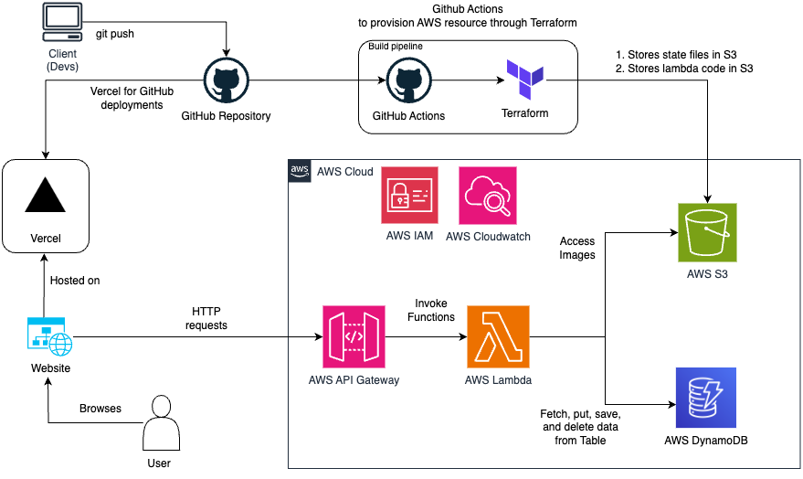

# TikTok Commerce

We imagined a future where E-Commerce meets Social Media, and Tiktok would be the perfect platform by having both TikTok Shop and TikTok Live, a streaming platform that has many Tiktokers streaming content live to millions of people every day and a virtual marketplace all on the same platform.  Tiktok Commerce is a web application for both Suppliers and TikTokers to manage their dropshipping platform.

## Installation & Testing
As we have taken down the deployments on Vercel and AWS, it is possible to test the frontend locally and re-provision the AWS resources through Terraform

Local Testing of our Frontend:

1) Download our code and open the project in a new terminal
2) Run the following commands:
3) `cd .\frontend\tt-hackathon-fe\`
4) `npm i`
5) `npm run dev`

To log in:

1) Click on "Log in" at the top right of the webpage
2) To log in as a seller, log in with seller@gmail.com
3) To log in as a tiktoker, log in with any email

To recreate the AWS architecture, it can be done by Github Actions or directly through your terminal.
Run the commands below
1) `cd terraform`
2) `aws configure`
3) Save your AWS credentials as environemnt variables locally
4) `export AWS_ACCESS_KEY_ID="your_accesskey"`  
   `export AWS_SECRET_ACCESS_KEY="your_secretkey"` 
   `export AWS_REGION="your_region"`
5) Create an S3 bucket to store the terraform state, copy the bucket name and bucket key name
6) `export AWS_BUCKET_NAME="your_bucketname"`  
   `export AWS_BUCKET_KEY_NAME="your_bucketkeyname"` 
7) `terraform init -backend-config="bucket=${AWS_BUCKET_NAME}" -backend-config="key=${AWS_BUCKET_KEY_NAME}" -backend-config="region=${AWS_REGION}"`
8) `terraform plan`
9) `terraform apply`

## Contributing

The project was contributed by:
1) Cleve Huang
2) Gregory Ong
3) Chua Yu Hao
4) Aloysius Ng
5) Brandon Christopher

## Additional Information

The entire backend is serverless and hosted on AWS and built through terraform and a pipeline deployed on Github actions.

aws_policies documents the policies applied in AWS
parameters such as AWS region, S3 bucket name... are stored as secrets in github actions

## Cloud Architecture 

